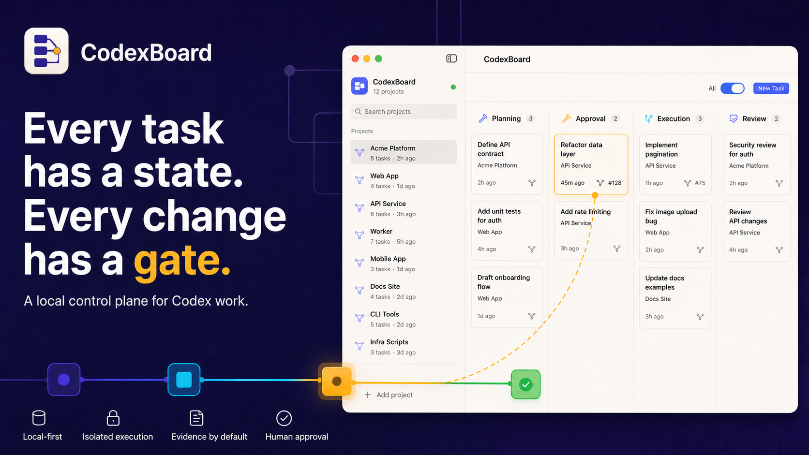

<div align="center">
  
  <h1>CodexBoard</h1>
  <p><strong>Every task has a state. Every change has a gate.</strong></p>
  <p>A local-first macOS control plane for Codex work.</p>
  <p><a href="README.md">简体中文</a> · <strong>English</strong></p>
</div>



CodexBoard turns disconnected Codex sessions into a visible, governed delivery workflow. It discovers local projects, keeps planning read-only, pauses at deliberate approval gates, runs changes in isolated worktrees, and brings evidence, diffs, and review history back to one task card.

> CodexBoard is under active development. The current build is local and ad-hoc signed; there is no notarized public release yet.

[](LICENSE)

## Why CodexBoard

| Local-first | Governed execution | Evidence by default |
| --- | --- | --- |
| Reuses your local Codex login and configuration. Project state remains on your Mac. | Planning is read-only. Commands, file changes, permissions, questions, and MCP requests stop for you. | Every run keeps its plan, model, duration, artifacts, unified diff, validation, and review outcome. |

## The workflow

1. **Create** — Pick a project, model, reasoning effort, Fast tier, Skills, Apps, attachments, dependencies, and workspace policy.
2. **Plan** — Start manually or enable Auto-run. Codex inspects the project in a read-only, no-network turn.
3. **Approve** — Edit and approve the plan. Runtime approvals open and highlight the exact card and send a privacy-safe macOS notification.
4. **Execute** — Run in the project or an isolated `codex/task-*` worktree with explicit filesystem and network boundaries.
5. **Review** — Inspect artifacts, test evidence, per-file stats, and unified diffs. Accept the delivery or request another run with feedback.

## Highlights

- Multi-project kanban for Inbox, Planning, Approval, Execution, Review, Completed, and Needs Attention.
- Git-root project discovery with a sidebar refresh action; non-Git folders remain available through explicit manual addition.
- Persistently remove projects from the sidebar without deleting folders, Codex threads, tasks, or attachments; add the folder again to restore it.
- Task-scoped model, reasoning effort, and Fast configuration that stays fixed across planning and execution.
- Structured local Skills and read-only Apps discovered through Codex app-server.
- Human-in-the-loop command, file, permission, user-input, MCP form, URL, and OAuth flows.
- Isolated Git worktrees, safe cleanup, dependency handoffs, controlled concurrency, and retry circuit breakers.
- English and Simplified Chinese UI, with system-following or explicit language selection in Settings.

## Requirements

- macOS 14 or later.
- Swift 6 / a compatible Xcode toolchain for source builds.
- Codex CLI installed and signed in, or a trusted Codex application that provides a usable Codex executable.

CodexBoard never reads or copies `~/.codex/auth.json`; it launches the local `codex app-server` and naturally reuses its current authentication and configuration.

## Build and run

```bash
./script/build_and_run.sh
```

Use the script rather than `swift run CodexBoard`. It builds a complete macOS app bundle, compiles the icon and localization catalogs, signs the app, and launches it through LaunchServices.

For a release build, strict signature checks, ZIP verification, and an isolated launch:

```bash
./script/build_and_run.sh --verify
```

The resulting archive is written to `dist/CodexBoard-macOS.zip`.

Create a versioned local-preview release kit with SHA-256 checksums, release notes, and a manifest:

```bash
./script/package_release.sh
```

See [CHANGELOG.md](CHANGELOG.md) for release history and [docs/RELEASING.md](docs/RELEASING.md) for signing, notarization, and public-release prerequisites.

## Development

```bash
swift test
```

The SwiftUI interface is coordinated by `BoardStore`; `CodexAppServerClient` speaks the local app-server protocol; `ProjectDiscoveryService` groups conversations by Git root while filtering ordinary session folders and CodexBoard-managed worktrees; `WorktreeManager`, `BoardPersistence`, and `AttachmentStorage` keep execution, snapshots, and imported images bounded and recoverable.

## Security boundaries

- Read-only planning with no network access.
- Execution writes only to the chosen project/worktree; network access is an explicit preference.
- Auto-run never auto-approves runtime interactions.
- Notification text is generic and includes only a task UUID in its payload.
- OAuth and MCP URLs open only after a user action and must use HTTP(S).
- Secret answers and pending interactions are runtime-only and never persisted to `board.json`.
- Dirty or unmanaged worktrees are never forcibly deleted.

## Current limitations

- The distribution ZIP is ad-hoc signed, not Developer ID signed or notarized.
- CodexBoard does not merge task branches or create pull requests automatically.
- Skills, Apps, MCP interactions, and approvals depend on experimental Codex app-server APIs and may vary by CLI version.

## License and trademarks

CodexBoard source code, documentation, and original artwork are licensed under
the [Apache License 2.0](LICENSE). See [NOTICE](NOTICE) for third-party
attribution. That copyright license does not grant trademark rights in the
CodexBoard name, logo, or app icon; see [TRADEMARKS.md](TRADEMARKS.md).
CodexBoard is an independent project and is not affiliated with or endorsed by
OpenAI.
