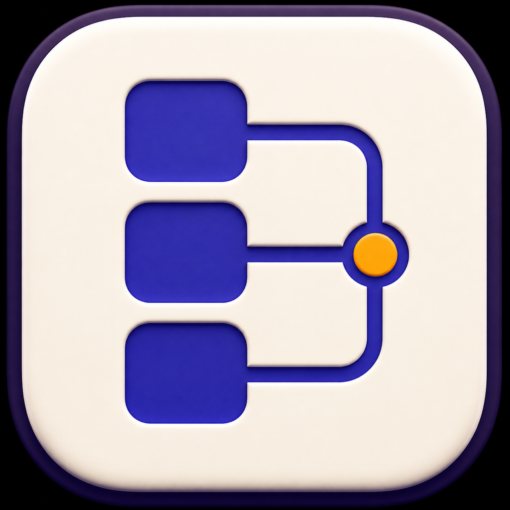
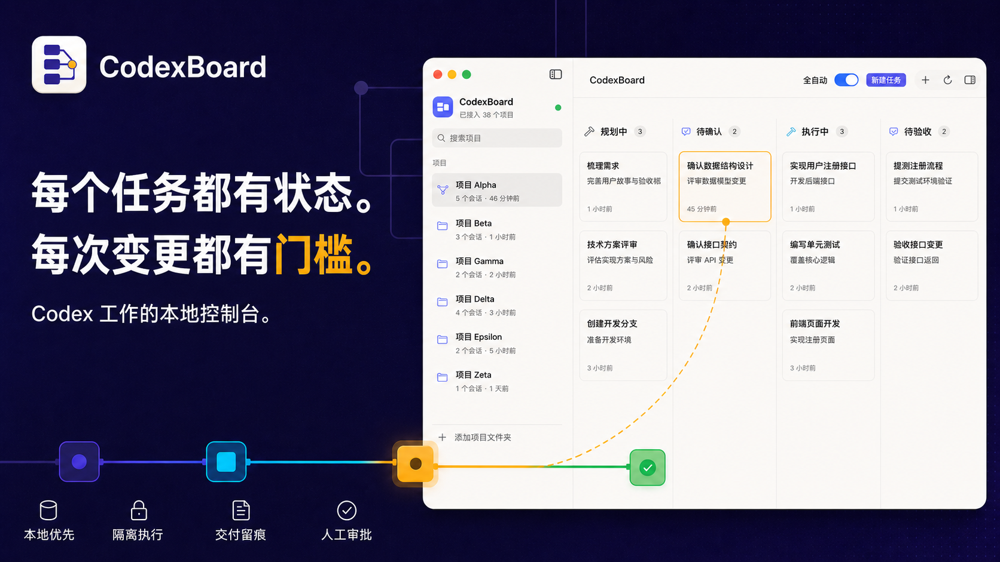

<div align="center">
  
  <h1>CodexBoard</h1>
  <p><strong>每个任务都有状态。每次变更都有门槛。</strong></p>
  <p>Codex 工作的本地控制台。</p>
  <p><strong>简体中文</strong> · <a href="README.en.md">English</a></p>
</div>



CodexBoard 是一个本地优先的 macOS 项目管理看板。它可以同时连接本机和多台无图形 SSH 主机上的 Codex app-server，统一读取项目、排队任务和查看执行状态，并让每张任务卡在所属主机的同一个 Codex thread/session 中依次完成：

> CodexBoard 正在积极开发中。当前产物仅用于本地构建和 ad-hoc 签名，尚无经过 Apple 公证的正式公开版本。

[](LICENSE)

## 为什么选择 CodexBoard

| 本地优先 | 有门槛的执行 | 默认留存证据 |
| --- | --- | --- |
| 复用本机 Codex 登录与配置，项目状态保留在 Mac 上。 | 规划只读；命令、文件、权限、问题与 MCP 请求都能停下来等你。 | 每次运行都保留方案、模型、耗时、交付物、Diff、验证与验收结果。 |

## 从需求到交付

1. **创建**：选择项目、模型、推理强度、Fast、Skills、Apps、附件、依赖与工作区策略。
2. **规划**：手动开始或开启全自动；Codex 在只读、无网络的 Turn 中检查项目并生成方案。
3. **审批**：编辑并确认方案；运行时审批会自动打开、高亮准确卡片，并发送隐私安全的 macOS 通知。
4. **执行**：在当前项目或隔离的 `codex/task-*` Worktree 中运行，并受明确的文件系统与网络边界约束。
5. **验收**：检查交付物、测试证据、逐文件统计与 unified diff；确认完成或附反馈发起下一轮。

## 产品定位

CodexBoard 是一个本地优先的 macOS 项目管理看板，面向希望同时管理多个代码项目和 Codex 任务的开发者。它复用本机 Codex 的登录与配置，将需求从“待办”推进到“已完成”，并在写入代码前强制经过独立的只读规划。

应用从本机 `codex app-server` 读取项目历史，把线程按 Git 根目录聚合，并过滤普通会话目录和 CodexBoard 托管 Worktree。每张任务卡在同一个 Codex thread/session 中延续上下文，从规划、执行到人工验收都保留可追溯记录。

## 核心工作流

1. **发现项目**：从 Codex 历史中识别 Git 根目录；侧边栏可随时刷新，也可手动添加非 Git 或未出现在历史中的本地目录。
2. **创建任务**：输入 Issue 或开发计划，可附加本地文件或从剪贴板粘贴截图，并选择模型、推理强度、Fast 模式，以及本机 Codex 当前可用的 Skills 与 Apps。普通任务先停留在待办，等待手动开始。
3. **只读规划**：点击“开始规划”后，Codex 检查仓库的代码、文档、测试和约束，生成可编辑的中文 Markdown 方案。此阶段不允许写入项目或访问网络；当前只允许选择全部已启用工具均为只读的 App。
4. **确认与排队**：人工确认方案后进入执行；全自动模式会在创建后立即规划并跳过方案确认，但不会放宽权限。
5. **隔离执行**：Git 项目默认可为任务创建独立 `codex/task-*` 分支和 Worktree；直接写当前项目的任务仍会串行，多个隔离 Worktree 可按全局上限并发。
6. **交付与验收**：执行结束后集中展示可打开的文件交付物、验证结果与残留风险；代码交付会按文件呈现增删统计和 unified diff。验收人可确认完成，也可附上反馈发起下一轮执行。

## 主要能力

- **多项目看板**：覆盖待办、规划中、待确认、执行中、待验收、已完成和需要处理等状态。
- **固定运行配置**：从本机 Codex 实时模型目录选择模型、推理强度和 Fast 服务层级，配置会随任务保存并在规划、执行和恢复时保持一致。
- **Skills 与 Apps**：从 app-server 读取项目可用 Skills 和已安装、已启用且可调用的 Apps；任务创建时会冻结所选意图和展示信息。每次规划、执行前仍会重新验证当前目录，已不可用或不再纯只读的 App 不会注入 Turn。含写入工具的 App 会显示但不可选择。
- **人工交互与审批**：命令、文件修改、权限、补充问题及 MCP 表单都会在任务详情中暂停并等待人工响应；全自动任务也不会自动批准。
- **待批提醒**：出现运行时交互或方案确认时，应用会打开主窗口、定位并高亮相关卡片，同时发送 macOS 通知；点击通知会返回仍在等待响应的任务。
- **MCP 连接管理**：设置中的“连接”页可查看 MCP 工具和 OAuth 状态。登录及外部授权链接只会在用户点击后交给系统浏览器打开。
- **附件输入**：本地文件作为只读输入传给任务；粘贴的截图会复制到 CodexBoard 的私有数据目录。
- **Run 历史与交付物**：规划和执行的每次尝试都保存为独立 Run，记录模型、时间、结果、文件交付物、代码 Diff、错误和验收意见；返工前后的交付可分别回看。
- **可控并发与恢复**：可设置全局最大并发数；连接中断或任务失败时会转入“需要处理”，避免静默重复副作用。
- **任务依赖**：创建任务时可选择同项目的前置任务。下游会等待上游通过验收，并把上游交付摘要、文件、测试、Commit 或 PR 信息带入规划。
- **失败熔断**：仅对进入写入 turn 前的临时启动错误限次重试；认证、限流、工作区、连接和执行期失败会保留现场并立即熔断。
- **Worktree 生命周期**：执行前按需创建并复用独立工作区；完成后可在详情中显示或安全清理，脏工作区不会被强制删除，任务分支会保留。
- **macOS 状态栏**：主窗口关闭后应用继续驻留，状态栏窗口会展示规划中和执行中的任务，并支持返回任务或停止运行。
- **中英文界面**：支持简体中文、English 和跟随 macOS；可在设置中随时切换，代码、模型名、Skill/App 名与 Codex 原始输出保持不变。

## 运行要求与快速开始

运行 CodexBoard 需要：

- macOS 14 或更高版本。
- 用于源码构建的 Swift 6 工具链（可通过对应版本的 Xcode 获得）。
- 本机已安装并登录 Codex CLI，或已安装包含可用 Codex 可执行文件的受信任 Codex 应用。CodexBoard 不会代为安装或登录 Codex。

在项目根目录中构建、签名并启动应用：

```bash
./script/build_and_run.sh
```

这是 SwiftUI GUI 应用，请勿直接执行 `swift run CodexBoard` 或
`.app/Contents/MacOS/CodexBoard`。这些方式会绕过 LaunchServices，在某些
启动上下文中会导致 AppKit 在注册应用时中止。开发和验证均使用上述
`./script/build_and_run.sh` 入口，它会构建完整 `.app` 并通过 LaunchServices 启动。

首次启动后，应用会连接本机 `codex app-server` 并载入历史 Git 项目。侧边栏的刷新按钮可加入新项目；非 Git 或未出现在历史中的目录可手动添加。上下文菜单中的“从列表移除”只会持久化隐藏项目，不会删除磁盘目录、Codex 会话或已有任务，手动重新添加即可恢复显示。

## 架构与数据流

- SwiftUI 界面负责项目侧边栏、看板、任务创建、详情与状态栏窗口。
- `BoardStore` 是主状态协调器，管理项目、任务阶段、执行队列、流式更新和持久化时机。
- `CodexAppServerClient` 通过本地标准输入/输出与 `codex app-server` 通信，启动或恢复 thread，并接收规划与执行进度。
- `ProjectDiscoveryService` 只检查 app-server 返回或用户手动添加的路径，将 Git 工作目录归并到对应的仓库根目录，并排除普通会话目录和应用托管 Worktree。
- `WorktreeManager` 通过参数化 Git 子进程创建、复用、检查和移除应用管理的 Worktree，并拒绝删除含未提交改动或不在托管目录下的路径。
- `BoardPersistence` 将看板快照原子写入本地 JSON；附件存储独立管理由剪贴板导入的截图。

主窗口关闭后，CodexBoard 会继续驻留在 macOS 状态栏。状态栏小窗口会列出所有
“规划中”和“执行中”的任务，显示所属主机、项目与实时进度，并可一键回到任务或停止任务。

## 远程主机

远端需要先安装并登录 Codex CLI，且以下命令应能从 Mac 非交互执行：

```bash
ssh -T your-host-alias 'exec codex app-server --stdio'
```

在“设置 → 主机”中可直接选择 `~/.ssh/config` 里发现的具体 `Host` 别名，也可手动输入；随后可测试连接、启停主机并设置每台主机的执行并发数。远程项目通过以 `/` 开头的绝对路径添加。相同路径位于不同主机时会被视为不同项目。

CodexBoard 只集中管理由它创建或恢复的 app-server 任务，不会接管一个已经在其他终端里交互运行的任意 CLI 进程。当前连接使用 SSH 承载的 stdio；若 Mac 应用退出或 SSH 中断，其他主机不受影响。重新启动或点击“检查后继续执行”时，应用会先用 `thread/read` 核对原 Turn：已完成就直接恢复结果，仍在运行就重新订阅，只有明确失败或中断后才允许启动新 Turn，未知状态一律暂停以避免重复副作用。

## GPT Live 创建任务

工具栏中的“GPT Live”可通过语音或文字澄清当前项目的需求，并生成一组可编辑的任务草稿。只有用户逐条确认或点击“全部确认创建”后，草稿才会成为普通看板任务；Live 会话本身不能批准方案或直接执行代码。OpenAI Platform API key 可选择保存在本机 macOS 钥匙串，只会注入独立的本机 Live app-server 子进程，不会写入 `board.json`、Codex 登录文件或发送到 SSH 主机。

GPT Live 使用 Codex app-server 的实验性 Realtime 接口，需要可用的 OpenAI Platform API key 和麦克风权限。普通 Codex 任务仍复用各自主机现有的 Codex 登录。

## 安全边界

- 不读取或复制本机或远端的 `~/.codex/auth.json`；每台主机上的 app-server 自然复用该主机当前 Codex 登录和配置。
- 远程连接固定调用系统 `/usr/bin/ssh`，复用现有 SSH config/agent；应用不读取或保存私钥，不把 app-server 端口暴露到公网。
- SSH 主机别名作为独立 argv 传入且经过严格校验；远端 stderr 只保留受限长度的尾部用于诊断。
- 项目扫描使用 `thread/list` 的 state DB 快速路径，不扫描或保存历史提示词、回复正文与 rollout JSONL。
- 远程路径从对应主机的 app-server 或用户输入取得，绝不会拿到本机 `FileManager`、Git 或 Finder 中探测。
- 规划阶段只读；执行阶段默认只能写入所选项目目录，网络访问由设置控制。
- 独立 Worktree 保存在 `~/Library/Application Support/CodexBoard/worktrees/`；清理操作不使用强制删除，并保留 Git 分支供后续合并或审查。
- “全自动”会自动开始规划并跳过方案确认，但不扩大文件系统权限。
- 纯只读 App 可用于规划与执行。包含写入工具的 App 当前不会被注入 Turn：本机 App/tool 级配置可能覆盖默认审批策略，在具备不可绕过的受管策略前，CodexBoard 不把文案提示当作安全边界。
- 交互请求只保存在内存中；补充问题的答案（包括 SecureField 输入）不会写入任务日志或 `board.json`。连接中断、Turn 结束或任务取消时会清理待响应状态。
- 系统通知仅使用通用提示文字，载荷只包含任务 UUID，不显示任务标题、项目、命令、目录、问题或授权链接。
- OAuth 与 MCP URL 仅接受 `http`/`https`，应用不会自动打开链接。
- 看板数据保存在 `~/Library/Application Support/CodexBoard/board.json`，其中只记录用户所选文件的本地路径，不会复制或改写源文件。
- 从剪贴板粘贴的截图由应用保存在 `~/Library/Application Support/CodexBoard/attachments/<task-id>/`，删除任务时会一并清理。数据目录权限为 `0700`，文件权限为 `0600`。
- 文件系统根目录 `/` 永远不能作为任务工作区；启动远端工作前必须先成功持久化 thread/turn 状态。
- 看板 JSON 还会记录 SSH 别名、主机显示名和远程路径，但不会保存 SSH 凭据、私钥或 Codex token。
- 远程任务暂不上传本机附件，也不在 Mac 上为远程仓库创建 Worktree；相关选项会在创建任务时停用并给出说明。
- GPT Live API key 可选存入 macOS 钥匙串，运行时只进入专用本机子进程环境；普通 Codex 连接和 SSH 子进程不会继承它。

## 开发

运行单元测试：

```bash
swift test
```

构建 release 版本、生成应用包、执行严格签名校验并从隔离目录启动：

```bash
./script/build_and_run.sh --verify
```

可分发产物位于 `dist/CodexBoard-macOS.zip`。构建脚本会在非 File Provider
目录中完成临时签名与严格校验，再从隔离的临时运行目录启动；`--verify` 只使用一次性的
`CODEXBOARD_DATA_PATH`，不会打开或改写真实看板。这样也可避免桌面同步服务附加的 Finder 元数据破坏应用签名。当前产物为本机 ad-hoc 签名，未做 Developer ID 签名或 Apple 公证。

生成带版本号、SHA-256、发布说明和清单的本地预览 Release Kit：

```bash
./script/package_release.sh
```

版本变更见 [CHANGELOG.md](CHANGELOG.md)，签名、公证和正式发布前置条件见
[docs/RELEASING.md](docs/RELEASING.md)。

Codex 桌面应用可读取 `.codex/environments/environment.toml` 中的 Run 动作。

### 文件类型图标

代码交付与改动文件列表使用精选的
[vscode-icons](https://github.com/vscode-icons/vscode-icons) SVG 图标，并在无法识别
文件类型或加载资源失败时回退到 SF Symbols。资源及其 MIT 许可保存在
`Resources/FileIcons/`；构建脚本会在签名前将它们复制到应用的
`Contents/Resources/FileIcons/`，修改图标清单后应通过 `--verify` 检查最终 ZIP。

## 当前限制

- `dist/CodexBoard-macOS.zip` 中的应用仅使用本机 ad-hoc 签名，尚未进行 Developer ID 签名或 Apple 公证，不是面向外部用户的正式发行包。
- 当前只负责创建与安全清理任务 Worktree，不自动合并分支、不自动创建 PR，也不会替用户决定如何处理未提交改动。
- Skills、Apps、MCP 表单和审批依赖本机 Codex app-server 的实验性 API；不同 Codex CLI 版本返回的目录与可用能力可能不同。插件不会作为单独实体运行，CodexBoard 使用插件实际提供并由 app-server 暴露的 Skill 或 App。

## 许可证与品牌

CodexBoard 的源代码、文档与原创美术采用 [Apache License 2.0](LICENSE)，第三方资源归属见
[NOTICE](NOTICE)。Apache-2.0 的著作权许可不授予 CodexBoard 名称、Logo 与应用图标的商标权；
品牌使用边界见 [TRADEMARKS.md](TRADEMARKS.md)。CodexBoard 是独立项目，与 OpenAI 没有关联，
也未获其背书。

欢迎来找我 [Linux DO](https://linux.do/u/das) [V2EX](https://www.v2ex.com/member/LDa)
